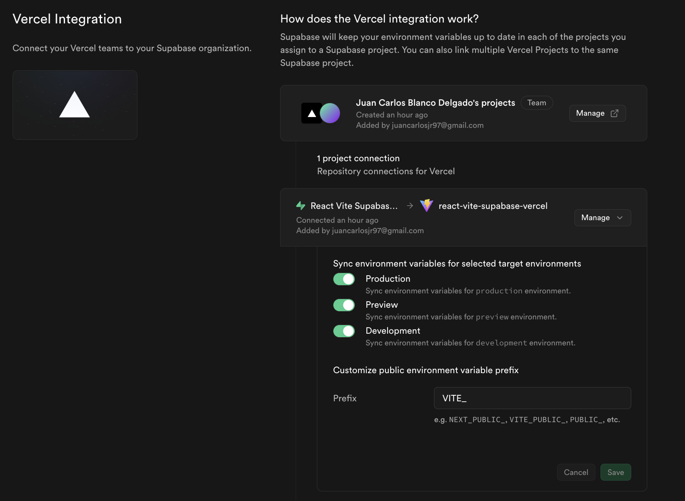
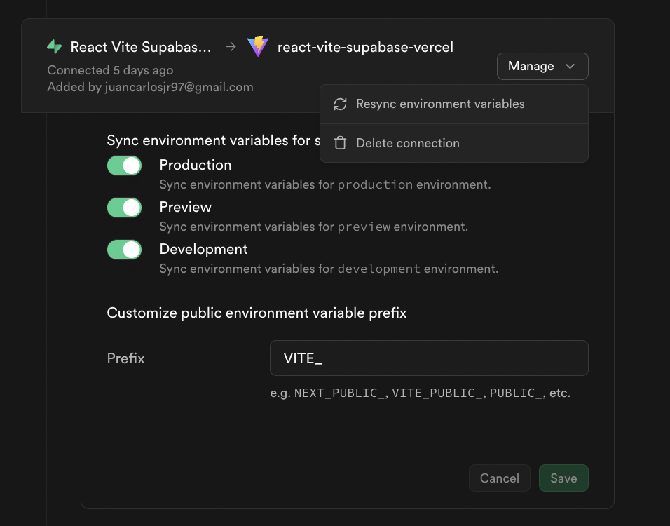
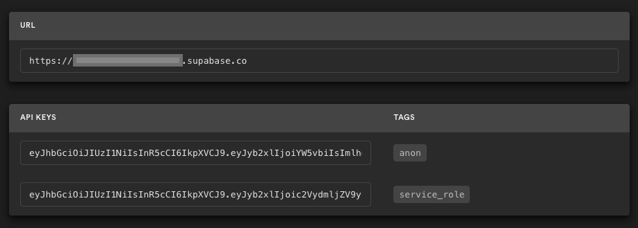

# React Vite Supabase Vercel | Public Template Project

This is a template project that demonstrates the usage of [React](https://react.dev/), [Vite](https://vite.dev/), [Supabase](https://supabase.com/), and [Vercel](https://vercel.com/).

## Demo

The demo is available [here](https://react-vite-supabase-vercel.vercel.app/).

## Overview

This project is a template designed to demonstrate the integration of React, Vite, Supabase, and Vercel. The primary intention behind this template is to provide a starting point for developers looking to build modern web applications with these technologies.

### Intention Behind the Idea

The main idea of this project is to showcase how to build a full-stack application with authentication and data management features. By using Supabase for backend services and Vercel for deployment, this template aims to simplify the development process and provide a seamless experience for developers.

### Key Features

- **Authentication**: The project includes user authentication using Supabase. This demonstrates how to implement sign-up, sign-in functionalities.
- **Todo List**: A simple todo list feature is included to show how to manage data with Supabase. Each todo item is public but only editable by the user who created it. This highlights how to handle user-specific data and permissions.
- **Responsive Design**: The template is built with a responsive design to ensure it works well on various devices.
- **Fast Development**: Using Vite as the build tool provides a fast and efficient development experience.

### Decisions and Considerations

- **Public Todos**: The decision to make todos public but only editable by the creator was made to demonstrate how authentication and authorization can be implemented. This feature shows how to restrict certain actions based on the user's identity.
- **Supabase Integration**: Supabase was chosen for its ease of use and powerful features, including authentication, real-time data, and SQL database management.
- **Vercel Deployment**: Vercel was selected for deployment due to its simplicity and seamless integration with modern frontend frameworks like React, and the integratation between GitHub, Supabase and Vercel.

This template serves as a practical example for developers to learn and build upon, providing a solid foundation for creating their own applications.

## Deployment

Since Supabase requires a paid plan to enable GitHub and Supabase automated integration, the Supabase configuration must be done manually as a one-time task during setup.

At the end of [deployment](#deployment) the website will be running connected to Supabase, and any Pull Request raised on GitHub will create a [preview environment](https://vercel.com/docs/deployments/preview-deployments) that will be connected to the single Supabase instance.

**_NOTE:_** All Vercel deployments, both preview and production, are connected to the same Supabase environment. Best practice would be to have ephemeral Supabase projects for Vercel preview deployments, allowing experimentation. However, while Vercel’s Preview Deployments are free, Supabase [Branching](https://supabase.com/docs/guides/deployment/branching), the feature needed for ephemeral environments, is part of the paid plan. Therefore, we use a single Supabase project for both production and preview deployments.

### Prerequisites

- [GitHub](https://github.com/)
- [Supabase Account](https://supabase.com/)

### Vercel - Part 1

[](https://vercel.com/new/clone?repository-url=https%3A%2F%2Fgithub.com%2Fjuancarlosjr97%2Freact-vite-supabase-vercel&project-name=react-vite-supabase-vercel&repository-name=react-vite-supabase-vercel&demo-title=React%20Vite%20Supabase%20Vercel&demo-description=GitHub%20template%20project%20using%20React%20Vite%20Supabase%20deployed%20on%20Vercel&demo-url=https%3A%2F%2Freact-vite-supabase-vercel.vercel.app%2F&integration-ids=oac_VqOgBHqhEoFTPzGkPd7L0iH6&external-id=https%3A%2F%2Fgithub.com%2Fjuancarlosjr97%2Freact-vite-supabase-vercel&skippable-integrations=1)

The Vercel Deploymnent will fork the project and create a GitHub project.

During the Vercel deployment, the integration step will ask to create a Supabase project that will be linked to the forked project.

### Supabase - Part 2

1. Open https://supabase.com/dashboard and find the project created on the [part 1](#vercel---part-1)

2. Run the migrations available from the [migration directory](./supabase/migrations/)

   For instructions on how to do this, see [here](https://supabase.com/docs/guides/database/overview#the-sql-editor).

### Update the Supabase Vercel Integration - Part 3

1. Open https://supabase.com/dashboard and find the project created on the [part 1](#vercel---part-1)

   Go to the Project Settings (the cog icon), open the Integrations tab, find the Vercel Integration that will be connected to the Vercel project created in [part 1](#vercel---part-1), and enable the sync environment variables for Preview and Development. Update the public environment variable prefix to `VITE_` as shown in the image below.

   

   For more information on the [Supabase Vercel Integration](https://vercel.com/marketplace/supabase).

2. Re-sync the environmental variable with Vercel by clicking on `Resync environment variables` as shown in the image below.

   

3. Redeploy the Vercel Production environment.

   For instructions on how to do this, see [here](https://vercel.com/docs/deployments/managing-deployments#redeploy-a-project).

At the end of Part 3, the deployment created with Vercel will be fully functional and connected to Supabase.

## Developer Documentation

### Postgres Row Level Security

This project uses high-level Authorization using Postgres' Row Level Security.
When you start a Postgres database on Supabase, it is populated with an `auth` schema and some helper functions.
When a user logs in, they are issued a JWT with the role `authenticated` and their UUID.
We can use these details to provide fine-grained control over what each user can and cannot do.

- For documentation on Role-based Access Control, refer to the [docs](https://supabase.com/docs/guides/auth/custom-claims-and-role-based-access-control-rbac).

### Local Development

1. Clone the repository

   ```bash
   git clone https://github.com/${GITHUB_USERNAME}/react-vite-supabase-vercel.git
   cd react-vite-supabase-vercel
   ```

   Alternatively, it can be opened directly from GitHub using GitHub codespaces, see [here](https://docs.github.com/en/codespaces/developing-in-a-codespace/creating-a-codespace-for-a-repository) for instructions.

2. Install dependencies

   ```bash
   # Install the Node.js version specified in the .nvmrc file
   nvm install

   # Switch to the Node.js version specified in the .nvmrc file
   nvm use

   # Install project dependencies based on the package-lock.json file
   npm ci
   ```

3. Set up environment variables

   Go to the Project Settings (the cog icon), open the API tab, and find your API URL and `anon` key. You'll need these in the next step.

   The `anon` key is your client-side API key. It allows "anonymous access" to your database until the user has logged in. Once they have logged in, the keys will switch to the user's own login token. This enables row-level security for your data. Read more about [Postgres Row Level Security](#postgres-row-level-security).

   

   **_NOTE_**: The `service_role` key has full access to your data, bypassing any security policies. These keys must be kept secret and are meant to be used in server environments and never on a client or browser.

   Copy the [.env.example](.env.example) file, rename it to `.env` in the root directory, and add your Supabase environment variables.

   ```sh
   VITE_SUPABASE_URL=supabase-url
   VITE_SUPABASE_ANON_KEY=supabase-anon-key
   ```

4. Run the development server

   ```bash
   npm run dev
   ```

## Contributing

Contributions are welcome! Please open an issue or submit a pull request.

## License

This project is licensed under the MIT License. See the [LICENSE](./LICENSE) file.

## Acknowledgment

The project is inspired by [nextjs-slack-clone](https://github.com/supabase/supabase/tree/master/examples/slack-clone/nextjs-slack-clone).

## Support Information

- [Learn React](https://react.dev/learn)
- [LICENSE](./LICENSE.md)
- [React Docs](https://react.dev/docs)
- [Supabase Docs](https://supabase.com/docs)
- [Supabase Example Projects](https://supabase.com/docs/guides/getting-started)
- [Supabase in 100 Seconds](https://www.youtube.com/watch?v=zBZgdTb-dns)
- [Vercel Docs](https://vercel.com/docs)
- [Vite Docs](https://vitejs.dev/guide/)
- [Vite in 100 Seconds](https://www.youtube.com/watch?v=KCrXgy8qtjM)
